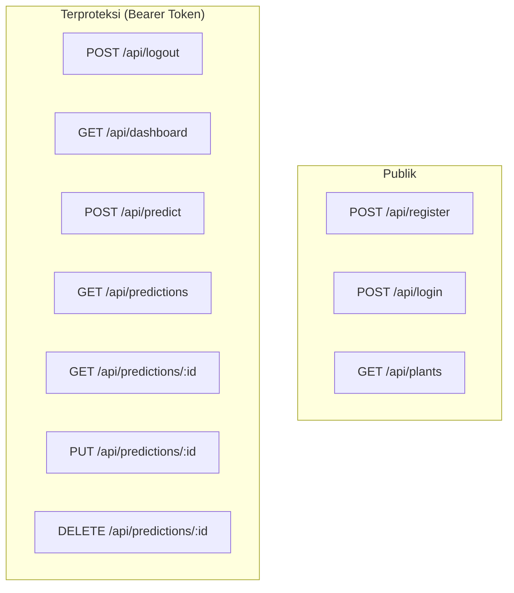

# Dokumen Dokumentasi API Endpoints RecoPlant

Berkas ini menyediakan spesifikasi lengkap untuk seluruh API Endpoints yang tersedia pada backend RecoPlant, termasuk struktur request, response sukses, penanganan error, batas limit panggilan (rate limit), dan otorisasi.

---

## 🏛️ Ketentuan Umum API

### 🔒 Otorisasi (Authentication)
* Rute yang ditandai **Protected** memerlukan autentikasi berupa token token JWT melalui header HTTP:
  ```http
  Authorization: Bearer <your_access_token>
  ```
* Autentikasi dikelola secara aman menggunakan **Laravel Sanctum**.

### ⏱️ Pembatasan Panggilan (Rate Limiting)
* **Rute Publik**: Dibatasi maksimal **10 request per menit** per IP address.
* **Rute Terproteksi**: Dibatasi maksimal **60 request per menit** per user/token.

---

## 📋 Daftar Rute API



---

## 🔐 1. Fitur Autentikasi (Public & Protected)

### 📌 1.1 Register Akun Baru
* **Endpoint**: `POST /api/register`
* **Keamanan**: Publik (Rate Limit: 10 req/min)
* **Request Body (JSON)**:
  | Field | Tipe | Aturan | Keterangan |
  | :--- | :--- | :--- | :--- |
  | `name` | `string` | Required | Nama lengkap pengguna |
  | `username` | `string` | Required, Unique | Username unik untuk login |
  | `password` | `string` | Required, Min: 6 | Password akun |
* **Contoh Request Payload**:
  ```json
  {
    "name": "Petani Mandiri",
    "username": "petani_mandiri",
    "password": "securepassword123"
  }
  ```
* **Response Sukses (`201 Created`)**:
  ```json
  {
    "token": "1|qXyZ...plainTextTokenString...",
    "user": {
      "id": 2,
      "name": "Petani Mandiri",
      "username": "petani_mandiri",
      "role": "guest",
      "created_at": "2026-06-29T14:40:02.000000Z",
      "updated_at": "2026-06-29T14:40:02.000000Z"
    }
  }
  ```

---

### 📌 1.2 Login Akun
* **Endpoint**: `POST /api/login`
* **Keamanan**: Publik (Rate Limit: 10 req/min)
* **Request Body (JSON)**:
  | Field | Tipe | Aturan | Keterangan |
  | :--- | :--- | :--- | :--- |
  | `username` | `string` | Required | Username terdaftar |
  | `password` | `string` | Required | Password akun |
* **Contoh Request Payload**:
  ```json
  {
    "username": "petani_tester",
    "password": "password123"
  }
  ```
* **Response Sukses (`200 OK`)**:
  ```json
  {
    "token": "2|abcD...plainTextTokenString...",
    "user": {
      "id": 1,
      "name": "Petani Tester",
      "username": "petani_tester",
      "role": "guest",
      "created_at": "2026-06-29T14:22:49.000000Z",
      "updated_at": "2026-06-29T14:22:49.000000Z"
    }
  }
  ```
* **Response Error Kredensial Salah (`401 Unauthorized`)**:
  ```json
  {
    "message": "Kredensial salah"
  }
  ```

---

### 📌 1.3 Logout Akun
* **Endpoint**: `POST /api/logout`
* **Keamanan**: Terproteksi (Bearer Token, Rate Limit: 60 req/min)
* **Response Sukses (`200 OK`)**:
  ```json
  {
    "message": "Logout berhasil"
  }
  ```

---

## 🌿 2. Fitur Ensiklopedia Tanaman (Public)

### 📌 2.1 Get Daftar Ensiklopedia Tanaman
Mengambil daftar rekomendasi tanaman beserta parameter iklim dan data NDVI ideal. Data diterjemahkan menggunakan kunci berbahasa Indonesia.
* **Endpoint**: `GET /api/plants`
* **Keamanan**: Publik (Bebas akses)
* **Response Sukses (`200 OK`)**:
  ```json
  {
    "status": "success",
    "data": [
      {
        "id": 1,
        "nama_komoditas_inggris": "Rice",
        "nama_lokal": "Padi",
        "nama_latin": "Oryza sativa",
        "deskripsi_umum": "Tanaman pangan utama di Asia Tenggara. Tumbuh optimal di lahan sawah dengan ketersediaan air yang cukup.",
        "musim_tanam_ideal": "Musim Hujan",
        "suhu_udara_ideal": "22-30°C",
        "kelembaban_lingkungan_ideal": "70-85%",
        "rentang_nilai_ndvi": "0.5-0.85",
        "rentang_nilai_evi": "0.35-0.65",
        "estimasi_durasi_panen": "110-130 hari",
        "url_gambar": null
      }
    ]
  }
  ```

---

## 🧠 3. Fitur Prediksi Lahan (Protected)

### 📌 3.1 Prediksi Tanaman Optimal
Mengirimkan 18 parameter pengindraan jauh/spasial ke ML service untuk dianalisis dan disimpan hasilnya ke riwayat prediksi user.
* **Endpoint**: `POST /api/predict`
* **Keamanan**: Terproteksi (Bearer Token, Rate Limit: 60 req/min)
* **Request Body (JSON)**:
  | Parameter | Tipe | Rentang / Aturan | Penjelasan / Makna Fisik |
  | :--- | :--- | :--- | :--- |
  | `NDVI` | `float` | Required, [-1.0, 1.0] | Normalized Difference Vegetation Index (tingkat kehijauan daun) |
  | `NDWI` | `float` | Required, [-1.0, 1.0] | Normalized Difference Water Index (tingkat kebasahan lahan/kadar air) |
  | `EVI` | `float` | Required, [-1.0, 1.0] | Enhanced Vegetation Index (indeks vegetasi yang dioptimalkan) |
  | `Red` | `float` | Required, [0.0, 1.0] | Pantulan radiasi spektrum warna Merah |
  | `Green` | `float` | Required, [0.0, 1.0] | Pantulan radiasi spektrum warna Hijau |
  | `NIR` | `float` | Required, [0.0, 1.0] | Pantulan radiasi Near-Infrared |
  | `SWIR` | `float` | Required, [0.0, 1.0] | Pantulan radiasi Shortwave Infrared |
  | `NIR_SWIR_ratio` | `float` | Required, [>= 0.0] | Rasio perbandingan NIR terhadap SWIR |
  | `Red_NIR_ratio` | `float` | Required, [>= 0.0] | Rasio perbandingan Merah terhadap NIR |
  | `DOY_sin` | `float` | Required, [-1.0, 1.0] | Sinus dari Day of Year (merepresentasikan kelancaran siklus kalender) |
  | `DOY_cos` | `float` | Required, [-1.0, 1.0] | Kosinus dari Day of Year |
  | `Season_enc` | `integer` | Required, [0, 3] | Kode pengindraan musim tanam (0-3) |
  | `Month` | `integer` | Required, [1, 12] | Bulan pengambilan sampel data |
  | `Stage_enc` | `integer` | Required, [0, 2] | Kode pengindraan fase pertumbuhan tanaman (0-2) |
  | `Latitude` | `float` | Required, Numeric | Titik koordinat Lintang wilayah lahan |
  | `Longitude` | `float` | Required, Numeric | Titik koordinat Bujur wilayah lahan |
  | `Cluster` | `integer` | Required, [>= 0] | ID pengelompokan (cluster spasial utama) |
  | `Cluster_K4` | `integer` | Required, [0, 3] | ID pengelompokan wilayah spasial mikro (K-Means K=4) |

* **Contoh Request Payload**:
  ```json
  {
    "NDVI": 0.5,
    "NDWI": -0.2,
    "EVI": 0.4,
    "Red": 0.1,
    "Green": 0.2,
    "NIR": 0.6,
    "SWIR": 0.15,
    "NIR_SWIR_ratio": 4.0,
    "Red_NIR_ratio": 0.16,
    "DOY_sin": 0.866,
    "DOY_cos": -0.5,
    "Season_enc": 1,
    "Month": 6,
    "Stage_enc": 0,
    "Latitude": -6.2,
    "Longitude": 106.8,
    "Cluster": 2,
    "Cluster_K4": 3
  }
  ```
* **Response Sukses (`201 Created`)**:
  ```json
  {
    "id": 15,
    "user_id": 1,
    "input_features": {
      "NDVI": 0.5,
      "NDWI": -0.2,
      "EVI": 0.4,
      "Red": 0.1,
      "Green": 0.2,
      "NIR": 0.6,
      "SWIR": 0.15,
      "NIR_SWIR_ratio": 4.0,
      "Red_NIR_ratio": 0.16,
      "DOY_sin": 0.866,
      "DOY_cos": -0.5,
      "Season_enc": 1,
      "Month": 6,
      "Stage_enc": 0,
      "Latitude": -6.2,
      "Longitude": 106.8,
      "Cluster": 2,
      "Cluster_K4": 3
    },
    "result_plant": "Rice",
    "confidence_score": 0.95,
    "updated_at": "2026-06-29T14:56:44.000000Z",
    "created_at": "2026-06-29T14:56:44.000000Z"
  }
  ```
* **Response Error Validasi Parameter (`422 Unprocessable Content`)**:
  ```json
  {
    "message": "The NDVI field must be between -1 and 1. (and 1 more error)",
    "errors": {
      "NDVI": [
        "The NDVI field must be between -1 and 1."
      ],
      "NIR": [
        "The NIR field is required."
      ]
    }
  }
  ```

---

### 📌 3.2 Get Riwayat Prediksi Pengguna (Paginated)
Mengambil seluruh daftar riwayat prediksi milik pengguna yang sedang terautentikasi (Terurut dari terbaru).
* **Endpoint**: `GET /api/predictions`
* **Keamanan**: Terproteksi (Bearer Token, Rate Limit: 60 req/min)
* **Response Sukses (`200 OK`)**:
  ```json
  {
    "current_page": 1,
    "data": [
      {
        "id": 15,
        "user_id": 1,
        "input_features": {
          "NDVI": 0.5,
          "NDWI": -0.2,
          "EVI": 0.4,
          "Red": 0.1,
          "Green": 0.2,
          "NIR": 0.6,
          "SWIR": 0.15,
          "NIR_SWIR_ratio": 4.0,
          "Red_NIR_ratio": 0.16,
          "DOY_sin": 0.866,
          "DOY_cos": -0.5,
          "Season_enc": 1,
          "Month": 6,
          "Stage_enc": 0,
          "Latitude": -6.2,
          "Longitude": 106.8,
          "Cluster": 2,
          "Cluster_K4": 3
        },
        "result_plant": "Rice",
        "confidence_score": 0.95,
        "notes": null,
        "created_at": "2026-06-29T14:56:44.000000Z",
        "updated_at": "2026-06-29T14:56:44.000000Z"
      }
    ],
    "first_page_url": "http://localhost/api/predictions?page=1",
    "from": 1,
    "last_page": 1,
    "last_page_url": "http://localhost/api/predictions?page=1",
    "next_page_url": null,
    "path": "http://localhost/api/predictions",
    "per_page": 10,
    "prev_page_url": null,
    "to": 1,
    "total": 1
  }
  ```

---

### 📌 3.3 Get Detail Prediksi Spesifik
Mengambil rincian data prediksi tertentu berdasarkan ID.
* **Endpoint**: `GET /api/predictions/{id}`
* **Keamanan**: Terproteksi (Bearer Token, Rate Limit: 60 req/min, Terproteksi IDOR)
* **Response Sukses (`200 OK`)**:
  ```json
  {
    "id": 15,
    "user_id": 1,
    "input_features": {
      "NDVI": 0.5,
      "NDWI": -0.2,
      "EVI": 0.4,
      "Red": 0.1,
      "Green": 0.2,
      "NIR": 0.6,
      "SWIR": 0.15,
      "NIR_SWIR_ratio": 4.0,
      "Red_NIR_ratio": 0.16,
      "DOY_sin": 0.866,
      "DOY_cos": -0.5,
      "Season_enc": 1,
      "Month": 6,
      "Stage_enc": 0,
      "Latitude": -6.2,
      "Longitude": 106.8,
      "Cluster": 2,
      "Cluster_K4": 3
    },
    "result_plant": "Rice",
    "confidence_score": 0.95,
    "notes": null,
    "created_at": "2026-06-29T14:56:44.000000Z",
    "updated_at": "2026-06-29T14:56:44.000000Z"
  }
  ```
* **Response Error Data Tidak Ditemukan / Milik User Lain (`404 Not Found`)**:
  ```json
  {
    "message": "Record not found."
  }
  ```

---

### 📌 3.4 Update Catatan Prediksi
Memperbarui isi kolom `notes` pada riwayat prediksi tertentu.
* **Endpoint**: `PUT /api/predictions/{id}`
* **Keamanan**: Terproteksi (Bearer Token, Rate Limit: 60 req/min, Terproteksi IDOR)
* **Request Body (JSON)**:
  | Field | Tipe | Aturan | Keterangan |
  | :--- | :--- | :--- | :--- |
  | `notes` | `string` | Required | Teks catatan tambahan dari petani/user |
* **Contoh Request Payload**:
  ```json
  {
    "notes": "Lahan ini membutuhkan pemupukan nitrogen tambahan sebelum penanaman padi dimulai."
  }
  ```
* **Response Sukses (`200 OK`)**:
  ```json
  {
    "id": 15,
    "user_id": 1,
    "input_features": {
      "NDVI": 0.5,
      "NDWI": -0.2,
      "EVI": 0.4,
      "Red": 0.1,
      "Green": 0.2,
      "NIR": 0.6,
      "SWIR": 0.15,
      "NIR_SWIR_ratio": 4.0,
      "Red_NIR_ratio": 0.16,
      "DOY_sin": 0.866,
      "DOY_cos": -0.5,
      "Season_enc": 1,
      "Month": 6,
      "Stage_enc": 0,
      "Latitude": -6.2,
      "Longitude": 106.8,
      "Cluster": 2,
      "Cluster_K4": 3
    },
    "result_plant": "Rice",
    "confidence_score": 0.95,
    "notes": "Lahan ini membutuhkan pemupukan nitrogen tambahan sebelum penanaman padi dimulai.",
    "created_at": "2026-06-29T14:56:44.000000Z",
    "updated_at": "2026-06-29T14:58:12.000000Z"
  }
  ```

---

### 📌 3.5 Hapus Riwayat Prediksi
Menghapus riwayat data prediksi tertentu dari database.
* **Endpoint**: `DELETE /api/predictions/{id}`
* **Keamanan**: Terproteksi (Bearer Token, Rate Limit: 60 req/min, Terproteksi IDOR)
* **Response Sukses (`200 OK`)**:
  ```json
  {
    "message": "Dihapus"
  }
  ```

---

## 📊 4. Fitur Dashboard (Protected)

### 📌 4.1 Get Ringkasan Dashboard
Mengambil ringkasan data pengguna yang sedang login.
* **Endpoint**: `GET /api/dashboard`
* **Keamanan**: Terproteksi (Bearer Token, Rate Limit: 60 req/min)
* **Response Sukses (`200 OK`)**:
  ```json
  {
    "message": "Dashboard siap",
    "user": {
      "id": 1,
      "name": "Petani Tester",
      "username": "petani_tester",
      "role": "guest",
      "created_at": "2026-06-29T14:22:49.000000Z",
      "updated_at": "2026-06-29T14:22:49.000000Z"
    }
  }
  ```
