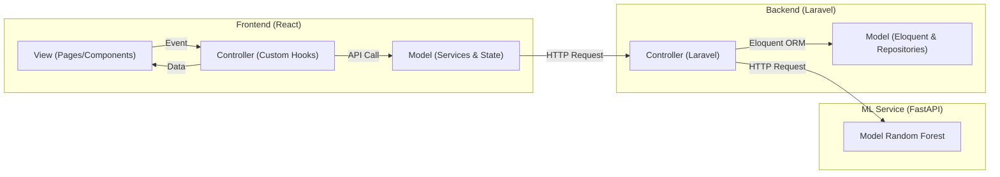

# 🏛️ Dokumentasi Arsitektur Sistem & Alur Kerja RecoPlant

Dokumen ini menjelaskan struktur arsitektur, pola desain, bagan alur fitur, dan organisasi folder pada proyek **RecoPlant** (Frontend, Backend, & Machine Learning Service).

---

## 🛠️ Tech Stack RecoPlant

Sistem RecoPlant dikembangkan menggunakan kombinasi teknologi modern untuk menjamin performa cepat, integrasi AI yang andal, serta antarmuka yang dinamis:

### 1. Frontend (React / Client)
* **Core Library**: React 19.2.7 (dengan Vite sebagai build tool super cepat).
* **Styling**: Tailwind CSS 3.4.19 (disokong oleh PostCSS & Autoprefixer).
* **Routing**: React Router DOM 7.18.0.
* **Animation**: Framer Motion 12.42.0 (untuk transisi visual premium).
* **Data Visualization**: Recharts 3.9.0 (untuk diagram statistik interaktif).
* **HTTP Client**: Axios 1.18.1 (dilengkapi central response interceptor).
* **Linter**: Oxlint 1.69.0.

### 2. Backend (REST API / Server)
* **Framework**: Laravel 11 (menuntut PHP 8.2+; saat ini berjalan di PHP 8.5.4).
* **Database**: MySQL 8.4 (mengelola data pengguna, riwayat prediksi, dan ensiklopedia).
* **Security & Auth**: Laravel Sanctum (untuk autentikasi stateless berbasis token JWT Bearer).
* **Testing**: PHPUnit (pengujian integrasi otomatis & unit testing).

### 3. Machine Learning (ML Service)
* **Framework**: FastAPI (Python 3.14.4) untuk penyajian model klasifikasi berkecepatan tinggi.
* **ASGI Server**: Uvicorn (menjalankan API FastAPI).
* **ML Core**: Scikit-Learn (menggunakan algoritma Random Forest Classifier untuk memprediksi kecocokan tanaman).

### 4. Containerization (DevOps)
* **Docker & Docker Compose**: Mengisolasi ketiga service (frontend, backend, ml-service) ke dalam satu jaringan bridge internal (`recoplant-network`).

---

## 🧭 1. Arsitektur Umum & Konsep MVC

Sistem RecoPlant dirancang menggunakan arsitektur modern yang memisahkan tanggung jawab secara tegas (*Separation of Concerns*) dengan menerapkan prinsip **Model-View-Controller (MVC)** baik di backend maupun diadaptasikan ke frontend.



### 1.1 Penjelasan Konsep MVC (Model-View-Controller)
Pola **MVC** membagi aplikasi menjadi tiga bagian utama untuk memisahkan logika bisnis dari antarmuka pengguna:
1. **Model**: Mengelola data, skema database, dan aturan bisnis. Di backend, ini diwakili oleh Eloquent Model dan Repositori. Di frontend, ini adalah service API dan penyimpanan state lokal/LocalStorage.
2. **View**: Antarmuka visual yang dilihat oleh pengguna. Di frontend, ini diwakili oleh React Pages dan Components. Lapisan ini murni pasif dan hanya menampilkan data yang disuplai oleh Controller.
3. **Controller**: Jembatan antara Model dan View. Controller menangani interaksi pengguna (event), memproses data input, memanggil Model/Service untuk mengambil data, dan memperbarui View.

### 1.2 Implementasi MVC di Backend (Laravel)
* **Model**: Representasi tabel database (`User`, `Prediction`, `PlantEncyclopedia`) menggunakan Eloquent ORM.
* **View**: Backend ini berfungsi sebagai Headless API, sehingga "View" eksternal adalah response format JSON yang dikirimkan ke frontend.
* **Controller**: File di `app/Http/Controllers` (seperti `PredictionController`, `AuthController`) yang menerima HTTP request, melakukan validasi input, memanggil domain repository, dan mengembalikan response JSON.

### 1.3 Adaptasi MVC di Frontend (Vite React)
React secara default tidak memiliki struktur MVC bawaan, namun RecoPlant merefaktornya menjadi pola arsitektur bersih (*Clean Architecture*) berbasis MVC:
* **Model**: File di `src/services/` (pemanggilan Axios ke API) dan state global/lokal (`AuthContext`, `useState`).
* **View**: File di `src/pages/` dan `src/components/` yang hanya berisi kode JSX & Tailwind CSS untuk merender tampilan.
* **Controller**: File di `src/hooks/` berupa **Custom Hooks** (seperti `useHistoryController`). Hook ini menyimpan state loading, memicu pemanggilan service, dan mengembalikan data bersih siap pakai ke View.

---

## 📂 2. Struktur Folder Proyek

Berikut adalah peta struktur folder utama proyek RecoPlant:

### 2.1 Backend (Laravel 11)
```text
backend/
├── app/
│   ├── Domain/                 # Lapisan Kontrak Bisnis (Abstraksi)
│   │   ├── Repositories/       # Interface untuk akses database
│   │   └── Services/           # Interface untuk layanan eksternal (ML Service)
│   ├── Http/
│   │   ├── Controllers/        # Controller MVC (AuthController, PredictionController)
│   │   └── Resources/          # Transformer data JSON (PlantResource)
│   ├── Infrastructure/         # Implementasi konkret dari Kontrak Domain
│   │   ├── Repositories/       # Query database MySQL nyata
│   │   └── Services/           # Request HTTP nyata ke ML Service
│   └── Models/                 # Eloquent Model (User, Prediction, PlantEncyclopedia)
├── config/                     # File konfigurasi Laravel (cors.php, database.php)
├── database/
│   ├── migrations/             # Skema tabel database MySQL
│   └── seeders/                # Pengisi data awal database (PlantEncyclopediaSeeder)
├── routes/
│   └── api.php                 # Peta endpoint REST API
└── tests/
    └── Feature/                # Pengujian unit & integrasi backend
```

### 2.2 Frontend (React & Vite)
```text
frontend/
├── public/                     # Aset gambar statis publik
├── src/
│   ├── components/             # Reusable UI Components (Component-Based)
│   │   ├── dashboard/          # Komponen grafik & kartu dashboard
│   │   ├── landing/            # Komponen halaman beranda
│   │   └── prediction/         # Komponen form & hasil prediksi
│   ├── context/                # State global autentikasi (AuthContext.jsx)
│   ├── data/                   # Data mock/fallback lokal (mockData.js)
│   ├── hooks/                  # Custom Hooks sebagai Controller MVC
│   │   ├── useDashboardController.js
│   │   ├── useHistoryController.js
│   │   └── usePredictionController.js
│   ├── middleware/             # Route Guards (PrivateRoute, PublicRoute)
│   ├── pages/                  # Halaman Utama (Views)
│   │   ├── LandingPage.jsx
│   │   ├── LoginPage.jsx
│   │   └── guest/              # Halaman terproteksi (Dashboard, History, Prediction)
│   ├── services/               # Lapisan Data & API (Model)
│   │   ├── api.js              # Axios Client & Response Interceptor (Otorisasi 401)
│   │   ├── authService.js      # Pemanggilan API Register, Login, & Logout
│   │   ├── errorHandler.js     # Penerjemah error teknis ke Bahasa Indonesia ramah pengguna
│   │   └── predictionService.js# Pemanggilan API Prediksi, Riwayat, & Dashboard
│   └── testing/                # Konfigurasi & Berkas Pengujian Frontend (Vitest) (Baru)
│       ├── setup.js            # Setup matcher jest-dom
│       ├── errorHandler.test.js# Pengujian penanganan error & penerjemah validasi
│       ├── AuthContext.test.jsx# Pengujian state auth & login/logout flow
│       ├── LoginPage.test.jsx  # Pengujian form login/register & tombol kembali
│       └── Navbar.test.jsx     # Pengujian navigasi guest vs logged-in
└── package.json                # Daftar dependensi modul npm
```

---

## 🔄 3. Alur Kerja Fitur (Feature Workflows)

### 3.1 Fitur Autentikasi Pengguna (Auth Flow)
```text
[Register Form] ──> submit ──> useLoginController ──> authService.registerUser()
                                                               │
[Dashboard] <── (Redirect) ── save token & user 🏎️ 201 Created ◄──┘
```
1. **Validasi & Pendaftaran Akun**: Form input di [LoginPage](file:///home/dekdw/Project/RecoPlant/frontend/src/pages/LoginPage.jsx) mengirim data ke `useLoginController` yang men-disable tombol (*loading state*). Sebelum dikirim, frontend memverifikasi panjang input secara real-time.
2. **Verifikasi Backend**: Backend memvalidasi data menggunakan pembatas keamanan (username 3-20 karakter, password 6-32 karakter, nama maks 50 karakter) dan mengenkripsi password dengan bcrypt, lalu mengembalikan Personal Access Token Sanctum (`201 Created`).
3. **Penyimpanan Sesi**: Frontend menyimpan token di `localStorage` dan meredireksi ke `/dashboard`.
4. **Proteksi Rute**: File [PrivateRoute.jsx](file:///home/dekdw/Project/RecoPlant/frontend/src/middleware/PrivateRoute.jsx) menjaga agar halaman dalam tidak bisa dibuka tanpa token valid. Jika token kedaluwarsa, interceptor di [api.js](file:///home/dekdw/Project/RecoPlant/frontend/src/services/api.js) langsung melakukan auto-logout demi keamanan.
5. **Resiliensi Redireksi Kembali (Back Navigation)**: Untuk mencegah *redirect loop* saat pengguna keluar/logout ketika berada di halaman terproteksi (`/dashboard`, `/predict`, `/history`), `PrivateRoute.jsx` mereplace entri sejarah browser dan mengirimkan state rute asal (`state={{ from: location.pathname }} replace`). Ketika di halaman login/register, tombol **"Kembali"** ([LoginPage.jsx](file:///home/dekdw/Project/RecoPlant/frontend/src/pages/LoginPage.jsx)) akan mendeteksi state tersebut dan mengarahkan pengguna langsung ke halaman Home (`/`) daripada memicu navigasi mundur (`navigate(-1)`) yang akan tertolak kembali oleh route guard.

### 3.2 Fitur Analisis Lahan & Prediksi (Suitability Prediction)
```text
1. User Input Form ──> Derived Values (Math.sin, NIR/SWIR ratio) ──> Payload
2. Payload ──> POST /api/predict ──> Laravel Controller ──> FastAPI ML Service (Port 8001)
3. FastAPI ──> Prediksi Tanaman & Akurasi ──> Laravel ──> Simpan di MySQL ──> FE (201 Created)
4. FE ──> GET /api/plants ──> Cocokkan Ensiklopedia ──> Tampilkan Gambar & Detail
```
1. **Perhitungan Parameter**: Pengguna menggeser parameter NDVI, NDWI, dll. Frontend secara otomatis menghitung nilai turunan spasial (seperti rasio NIR/SWIR dan sinus/kosinus DOY) dengan pengaman kliping nilai agar tidak terjadi division-by-zero atau error komputasi.
2. **Koneksi AI**: Saat tombol prediksi ditekan, backend menerima 18 parameter, meneruskannya ke layanan ML Python (FastAPI Random Forest), mendapatkan prediksi komoditas (misal: `Rice`) beserta akurasi (misal: `0.95`).
3. **Simpan Riwayat**: Backend menyimpan hasil tersebut ke tabel `predictions` database MySQL yang terikat dengan ID pengguna.
4. **Tampilan Hasil Swapped & Gambar Dinamis**: Response sukses (`201 Created`) dikirim balik ke frontend. Halaman bergeser ke atas secara otomatis: **Form Input** turun ke bawah, sementara **Hasil Rekomendasi, Detail Ensiklopedia, dan Gambar Representatif** (misal: `/padi.jpg`) yang dicocokkan dari database muncul di bagian paling atas halaman.

### 3.3 Fitur Riwayat & Pembaruan Catatan (History & Inline Update)
```text
[HistoryPage] ──> render list ──> Klik Edit Catatan (📝) ──> Ganti jadi Input Inline
                                                                      │
[Update Lokal] ── Klik Simpan (✔️) ──> PUT /api/predictions/{id} ◄─────┘
```
1. **Load Riwayat**: Halaman [HistoryPage](file:///home/dekdw/Project/RecoPlant/frontend/src/pages/guest/HistoryPage.jsx) memanggil `useHistoryController` yang melakukan `GET /api/predictions` untuk menampilkan daftar riwayat secara paginasi.
2. **Edit Inline**: Pengguna mengarahkan kursor ke kolom *Catatan Lapangan*, menekan tombol pensil (📝) untuk mengaktifkan input teks.
3. **Simpan ke DB**: Setelah menekan tombol ceklis (✔️), input dikirim ke API `PUT /api/predictions/{id}`. State lokal di-update secara instan agar antarmuka terasa sangat responsif dan hemat bandwidth jaringan.
4. **Hapus Data**: Menekan tombol sampah (🗑️) akan memicu `DELETE /api/predictions/{id}` dengan konfirmasi browser, lalu memperbarui daftar riwayat.

### 3.4 Fitur Dashboard Statistik Dinamis
1. **Muat Data**: Dashboard memanggil API `/dashboard` dan `/predictions`.
2. **Agregasi Client-Side**:
   - Jika riwayat prediksi pengguna ada, frontend menghitung jumlah prediksi hari ini, mengelompokkan tanaman terpopuler (`top_plants`), dan menghitung rata-rata parameter spektral (`NDVI`, `NDWI`, `EVI`) per tanaman secara dinamis.
   - Jika riwayat masih kosong (`total = 0`), dashboard menampilkan visual dummy data agar barchart Recharts tetap terlihat estetis.
3. **Banner Offline**: Jika backend mati atau terjadi gangguan koneksi internet, dashboard memuat fallback data lokal dan menampilkan banner peringatan: *"⚠️ Gagal memuat data statistik terbaru. Menampilkan data offline."*

---

## ⚠️ 4. Penanganan Error yang Ramah Pengguna (User-Friendly Error Handling)

Sistem menggunakan modul pusat [errorHandler.js](file:///home/dekdw/Project/RecoPlant/frontend/src/services/errorHandler.js) untuk memproses semua Axios request-response error sebelum ditampilkan ke layar:
* **401 Unauthorized**: Token dihapus secara lokal, state auth dikosongkan, dan otomatis dialihkan ke halaman login.
* **422 Unprocessable Content**: Pesan validasi teknis (seperti keunikan database atau batasan desimal parameter satelit) diterjemahkan ke Bahasa Indonesia yang mudah dipahami (contoh: *"Username sudah digunakan. Silakan pilih username lain"*).
* **429 Too Many Requests**: Memblokir input form dan mendisable tombol, lalu menampilkan pesan: *"Terlalu banyak permintaan dalam waktu singkat. Harap tunggu 1-2 menit sebelum mencoba kembali."*
* **500 Internal Server Error & Network Timeout**: Jika database mengalami kendala atau ML Service tidak aktif, frontend menampilkan kartu peringatan sistem offline atau tombol *"Coba Lagi"* (Retry) untuk meningkatkan resiliensi.

---

## 🧮 5. Penghitungan Parameter Turunan (Derived Parameters Client-Side)

Dari 18 parameter masukan yang dikirim ke backend `/api/predict`, frontend melakukan komputasi lokal untuk **4 variabel turunan** demi efisiensi resource server dan meminimalisir waktu tunggu (latensi):
* **Siklus Hari (Day of Year)**:
  - $\text{DOY\_sin} = \sin(\text{DOY} \times \frac{2\pi}{365})$
  - $\text{DOY\_cos} = \cos(\text{DOY} \times \frac{2\pi}{365})$
* **Rasio Spektrometri**:
  - $\text{NIR\_SWIR\_ratio} = \frac{\text{NIR}}{\text{SWIR}}$
  - $\text{Red\_NIR\_ratio} = \frac{\text{Red}}{\text{NIR}}$

Rumus di atas diproses di [usePredictionController.js](file:///home/dekdw/Project/RecoPlant/frontend/src/hooks/usePredictionController.js#L36-L43) sebelum disatukan ke payload prediksi.

---

## 💻 6. Panduan Menjalankan Layanan Secara Lokal (Quick Start Guide)

Untuk menjalankan seluruh service RecoPlant di lingkungan lokal, buka 3 tab terminal terpisah:

### 1. Terminal 1: Machine Learning Service (FastAPI)
```bash
cd ml-service
.venv/bin/uvicorn app.main:app --host 127.0.0.1 --port 8001
```

### 2. Terminal 2: Backend REST API (Laravel 11)
Sebelum menjalankan, pastikan database MySQL telah terisi dengan data awal ensiklopedia:
```bash
cd backend
php artisan db:seed
php artisan serve --host=127.0.0.1 --port=8000
```

### 3. Terminal 3: Frontend Web (Vite React)
```bash
cd frontend
npm run dev
```
Buka browser pada alamat **`http://localhost:5173`**.

---

## 🧪 7. Pengujian & Penjaminan Kualitas (Testing & QA Guide)

### 7.1 Menjalankan Unit & Fitur Test Backend (PHPUnit)
Backend dilengkapi dengan 34 pengujian (Unit & Feature Tests) yang mencakup autentikasi, dashboard, ensiklopedia tanaman, validasi prediksi, serta integrasi riil (HTTP Client) dengan ML Service.
```bash
cd backend
php artisan test
```

### 7.2 Menjalankan Pengujian Unit & Integrasi Frontend (Vitest & React Testing Library)
Frontend dilengkapi dengan 24 pengujian otomatis menggunakan framework **Vitest** dan **React Testing Library** yang mensimulasikan lingkungan browser melalui **jsdom**. Berkas pengujian diatur pada folder [frontend/src/testing](file:///home/dekdw/Project/RecoPlant/frontend/src/testing).
* **errorHandler.test.js**: Memvalidasi penanganan status error HTTP Axios (400, 401, 403, 404, 422, 429, 500) dan penerjemahan validasi Laravel ke Bahasa Indonesia.
* **AuthContext.test.jsx**: Memvalidasi state login, register, dan logout.
* **LoginPage.test.jsx**: Menguji render form login/register, validasi form, dan logika kembali ke Home (`/`) saat logout.
* **Navbar.test.jsx**: Menguji hak akses tampilan menu navigasi berdasarkan kondisi login.

Untuk menjalankan test suite frontend:
```bash
cd frontend
npm run test
```

### 7.3 Menjalankan Linter & Build Frontend
* **Menjalankan Linter**: Memindai penulisan sintaksis dan bug kode frontend menggunakan linter super cepat Oxlint:
  ```bash
  cd frontend
  npm run lint
  ```
* **Kompilasi Produksi**: Membangun bundel aset produksi web untuk memverifikasi tidak ada kesalahan tipe atau kompilasi:
  ```bash
  cd frontend
  npm run build
  ```

---

## 🔗 8. Alur Interaksi Antar Layanan (Inter-Service Communication Flow)

Sistem RecoPlant terdiri dari 3 service independen yang saling berkomunikasi melalui protokol HTTP. Berikut adalah alur interaksi terperinci antar layanan tersebut:

```mermaid
sequenceDiagram
    autonumber
    actor Pengguna
    participant FE as Frontend (React)
    participant BE as Backend (Laravel)
    participant ML as ML Service (FastAPI)
    database DB as Database (MySQL)

    Pengguna->>FE: Isi Form & Klik Prediksi
    FE->>FE: Hitung Parameter Turunan (DOY, NIR/SWIR)
    FE->>BE: POST /api/predict (Bearer Token + JSON Payload)
    Note over FE,BE: Komunikasi REST API via Axios
    BE->>BE: Validasi Parameter Satelit (18 Parameter)
    alt Jika Validasi Gagal
        BE-->>FE: 422 Unprocessable Content (Error Validation)
        FE->>Pengguna: Tampilkan Error Ramah Pengguna
    else Jika Validasi Sukses
        BE->>ML: POST /predict (JSON Features)
        Note over BE,ML: Sinkron HTTP Request (Timeout 10s)
        alt Jika ML Service Offline
            ML--xBE: Connection Failed / 500
            BE-->>FE: 500 Internal Server Error (ML service error)
            FE->>Pengguna: Peringatan Gangguan Layanan AI
        else Jika ML Service Aktif
            ML-->>BE: 200 OK (plant: Rice, confidence: 0.95)
            BE->>DB: SQL INSERT (Simpan hasil ke predictions table)
            DB-->>BE: Success
            BE-->>FE: 201 Created (Data Prediction JSON)
            FE->>FE: Update state lokal & geser form ke bawah
            FE->>FE: GET /api/plants (Ambil detail ensiklopedia)
            FE->>Pengguna: Tampilkan Hasil Prediksi & Ensiklopedia Padi
        end
    end
```

### 8.1 Komunikasi Frontend $\leftrightarrow$ Backend (REST API)
* **Protokol**: HTTP/HTTPS dengan format payload JSON.
* **Keamanan Rute**: Rute terproteksi wajib membawa `Authorization: Bearer <token_sanctum>` pada header request. Token ini disisipkan secara otomatis oleh Axios request interceptor.
* **Keamanan Asal (CORS)**: Backend secara aktif memverifikasi origin request. Hanya origin terdaftar (`http://localhost:5173` & `http://127.0.0.1:5173`) yang diizinkan untuk melakukan transaksi data.

### 8.2 Komunikasi Backend $\leftrightarrow$ Machine Learning Service
* **Protokol**: HTTP lokal/internal.
* **DNS/Routing**:
  - **Docker Compose (Production)**: Backend memanggil ML service menggunakan DNS internal Docker `http://ml-service:8001`.
  - **Lokal (Development)**: Backend memanggil ML service di `http://127.0.0.1:8001` via konfigurasi `ML_API_URL` di file `.env`.
* **Resiliensi & Penanganan Timeout**: Request HTTP dari backend ke ML Service menggunakan pembatasan waktu (*timeout*) maksimal 10 detik. Jika ML Service mati atau lambat merespons, request dibatalkan (*gracefully aborted*) dan backend akan mengembalikan status 500 kepada frontend, menghindari terjadinya *hanging request* yang mengunci resource server.

---

## 🌾 9. Penjelasan Komoditas Tanaman (Predicted Crops Encyclopedia)

Sistem RecoPlant saat ini mendukung prediksi kesesuaian lahan untuk **5 komoditas tanaman utama**. Berikut adalah penjelasan mendalam mengenai karakteristik agronomi, rentang parameter indeks vegetasi (NDVI & EVI), serta kondisi ideal pertumbuhan masing-masing tanaman yang bersumber dari konfigurasi database di [PlantEncyclopediaSeeder.php](file:///home/dekdw/Project/RecoPlant/backend/database/seeders/PlantEncyclopediaSeeder.php):

### 9.1 Ringkasan Parameter Budidaya Tanaman

| No | Nama Tanaman (Lokal) | Nama Ilmiah (Latin) | Suhu Ideal | Kelembapan | Durasi Panen | Musim Tanam Ideal |
|:--:|:---|:---|:---:|:---:|:---:|:---|
| 1 | **Rice** (Padi) | *Oryza sativa* | 22 - 30°C | 70 - 85% | 110 - 130 hari | Musim Hujan |
| 2 | **Maize** (Jagung) | *Zea mays* | 21 - 30°C | 50 - 75% | 90 - 110 hari | Musim Kemarau - Peralihan |
| 3 | **Wheat** (Gandum) | *Triticum aestivum* | 10 - 24°C | 40 - 65% | 120 - 150 hari | Musim Dingin - Semi |
| 4 | **Cotton** (Kapas) | *Gossypium hirsutum* | 25 - 35°C | 40 - 60% | 150 - 180 hari | Musim Panas - Kemarau |
| 5 | **Sugarcane** (Tebu) | *Saccharum officinarum* | 24 - 38°C | 60 - 80% | 10 - 18 bulan | Sepanjang Tahun (Tropis) |

---

### 9.2 Detail Deskripsi & Indeks Vegetasi Satelit

Setiap tanaman memiliki profil indeks reflektansi spektral satelit (NDVI dan EVI) yang spesifik untuk membedakannya dengan vegetasi lain selama fase pertumbuhan aktif:

#### 1. Rice (Padi) — *Oryza sativa*
* **Deskripsi**: Tanaman pangan utama di Asia Tenggara. Tumbuh optimal di lahan sawah dengan ketersediaan air yang cukup. Membutuhkan curah hujan tinggi dan suhu hangat sepanjang musim tanam.
* **Rentang Indeks Reflektansi**:
  * **NDVI**: $0.50 \le \text{NDVI} \le 0.85$ (Mengindikasikan kerapatan tajuk sawah basah).
  * **EVI**: $0.35 \le \text{EVI} \le 0.65$ (Lebih tahan terhadap efek saturasi tanah basah).

#### 2. Maize (Jagung) — *Zea mays*
* **Deskripsi**: Tanaman serealia yang adaptif terhadap berbagai kondisi lahan. Digunakan sebagai pangan, pakan ternak, dan bahan baku industri. Membutuhkan drainase yang baik dan sinar matahari penuh.
* **Rentang Indeks Reflektansi**:
  * **NDVI**: $0.45 \le \text{NDVI} \le 0.80$
  * **EVI**: $0.30 \le \text{EVI} \le 0.60$

#### 3. Wheat (Gandum) — *Triticum aestivum*
* **Deskripsi**: Tanaman serealia musim dingin yang membutuhkan suhu rendah untuk vernalisasi. Cocok untuk lahan kering dengan curah hujan sedang. Merupakan bahan baku utama industri tepung dan roti.
* **Rentang Indeks Reflektansi**:
  * **NDVI**: $0.40 \le \text{NDVI} \le 0.75$
  * **EVI**: $0.25 \le \text{EVI} \le 0.55$

#### 4. Cotton (Kapas) — *Gossypium hirsutum*
* **Deskripsi**: Tanaman industri penghasil serat alami. Membutuhkan musim panas yang panjang dan kering saat periode pembentukan *boll* (buah kapas). Sensitif terhadap *frost* (embun beku) dan genangan air.
* **Rentang Indeks Reflektansi**:
  * **NDVI**: $0.35 \le \text{NDVI} \le 0.70$
  * **EVI**: $0.25 \le \text{EVI} \le 0.50$

#### 5. Sugarcane (Tebu) — *Saccharum officinarum*
* **Deskripsi**: Tanaman industri penghasil gula dan bioetanol. Membutuhkan periode panas panjang dan air berlimpah saat vegetatif, lalu kondisi kering saat pemasakan untuk memaksimalkan kadar sukrosa.
* **Rentang Indeks Reflektansi**:
  * **NDVI**: $0.55 \le \text{NDVI} \le 0.90$ (Tinggi karena struktur tajuk yang sangat rapat dan tebal).
  * **EVI**: $0.40 \le \text{EVI} \le 0.70$

---

## 🛰️ 10. Sinkronisasi Validasi Parameter Satelit & Input Form

Untuk menjaga stabilitas performa model prediksi `crop_model.pkl` dan mencegah terjadinya input di luar rentang belajar (out-of-bounds), sistem mengimplementasikan aturan validasi terkoordinasi tiga lapis (Frontend Slider, Backend Validator, dan FastAPI Schema):

### 10.1 Tabel Aturan Rentang Masukan Parameter

| Parameter | Tipe Data | Batasan Nilai (Min / Max) | Keterangan & Deskripsi Agronomi |
| :--- | :---: | :---: | :--- |
| **NDVI** | Float | `-1.0` s/d `1.0` | *Normalized Difference Vegetation Index* (Kerapatan Hijau Daun) |
| **NDWI** | Float | `-1.0` s/d `1.0` | *Normalized Difference Water Index* (Kandungan Air Tanah/Kanopi) |
| **EVI** | Float | `-2.0` s/d `2.0` | *Enhanced Vegetation Index* (Indeks Vegetasi Terkoreksi Efek Atmosfer) |
| **Red** | Float | `0.0` s/d `3500.0` | Reflektansi Spektrum Merah (Skala Ribuan Digital Number) |
| **Green** | Float | `0.0` s/d `2500.0` | Reflektansi Spektrum Hijau (Skala Ribuan Digital Number) |
| **NIR** | Float | `1000.0` s/d `5000.0` | Reflektansi Spektrum Inframerah Dekat (*Near-Infrared*) |
| **SWIR** | Float | `0.0` s/d `4500.0` | Reflektansi Spektrum Inframerah Gelombang Pendek (*Shortwave Infrared*) |
| **NIR_SWIR_ratio** | Float | `-10.0` s/d `10.0` | Rasio Spektrometri NIR terhadap SWIR (Dihitung otomatis / Dikliping) |
| **Red_NIR_ratio** | Float | `0.0` s/d `10.0` | Rasio Spektrometri Red terhadap NIR (Dihitung otomatis / Dikliping) |
| **DOY_sin** | Float | `-1.0` s/d `1.0` | Komponen Sinus dari Siklus Hari (*Day of Year*) |
| **DOY_cos** | Float | `-1.0` s/d `1.0` | Komponen Kosinus dari Siklus Hari (*Day of Year*) |
| **Season_enc** | Integer | `0` atau `1` | Enkode Musim: Rabi (`0`) atau Kharif (`1`) |
| **Month** | Integer | `1` s/d `12` | Bulan Kalender Pertanian |
| **Stage_enc** | Integer | `-1` s/d `7` | Fase Pertumbuhan Tanaman (-1 s/d 7) |
| **Latitude** | Float | `24.0` s/d `36.0` | Batas Wilayah Lintang Geografis (Sesuai model area Asia Selatan) |
| **Longitude** | Float | `64.0` s/d `75.0` | Batas Wilayah Bujur Geografis (Sesuai model area Asia Selatan) |
| **Cluster** | Integer | `0` atau `1` | Pengelompokan Wilayah Iklim/Mikro |
| **Cluster_K4** | Integer | `0` s/d `3` | Pembagian Klaster Iklim Sekunder (K-Means K=4) |

### 10.2 Detail Implementasi Tiga Lapis (Three-Tier Validation)

1. **Frontend Layer (`Vite React`)**:
   * Komponen form input (`PredictionForm.jsx`) membatasi masukan numerik secara visual menggunakan komponen slider dengan atribut `min`, `max`, dan `step` sesuai batas di atas.
   * Parameter spasial kalkulasi (`NIR_SWIR_ratio` dan `Red_NIR_ratio`) diproses melalui fungsi `calculateDerived` di `usePredictionController.js` dengan pengaman pembagian (`1e-6`) dan pembatasan rentang (`Math.max`/`Math.min`) agar data tidak bernilai tak terhingga (`NaN` atau `Infinity`).
   * Validasi client-side di halaman autentikasi (`useLoginController.js`) memastikan nama tidak melebihi 50 karakter, username antara 3-20 karakter, dan password antara 6-32 karakter sebelum data dikirim ke API.

2. **Backend API Layer (`Laravel 11`)**:
   * Menggunakan Form Request Class `PredictRequest.php` untuk memvalidasi payload JSON yang masuk dari Axios client sebelum dikirim ke FastAPI.
   * Jika ada parameter di luar jangkauan, backend langsung memotong alur kerja dan mengembalikan response `422 Unprocessable Content` dengan pesan error terjemahan Bahasa Indonesia yang ramah pengguna.

3. **Machine Learning Service Layer (`FastAPI Python`)**:
   * Schema Pydantic `plantPredictionInput` (di `app/schemas/plant_schema.py`) menerapkan decorator `Field(ge=..., le=...)` untuk verifikasi tipe data dan rentang matematis pada level service ML.
   * Skema ini memproteksi runtime model agar tidak mengalami malfungsi/out-of-bounds saat dieksekusi oleh library `joblib`/`scikit-learn` pada model Random Forest.
